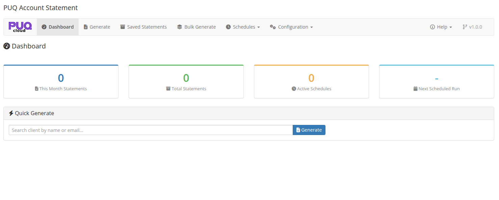

# Dashboard

### Account Statement addon **[WHMCS](https://puqcloud.com/link.php?id=77)**
#####  [Order now](https://puqcloud.com/store/whmcs-addon-modules) | [Download](https://download.puqcloud.com/WHMCS/addons/PUQ_WHMCS-Account-Statement/) | [FAQ](https://community.puqcloud.com/)

The Dashboard is the home page of the module, available at: **Addons** > **PUQ Account Statement** > **Dashboard**

It provides a complete overview of your statement activity — key metrics, quick generation, recent statements, and upcoming schedules.

*02-dashboard.png*

---

## Key Metrics

The top section displays summary cards with color-coded borders:

| Metric | Description |
|--------|-------------|
| **This Month Statements** | Number of statements generated in the current month |
| **Total Statements** | Total number of saved statements in the archive |
| **Active Schedules** | Number of currently active automatic schedules |
| **Next Scheduled Run** | Date and time of the next scheduled statement generation |

---

## Quick Generate

A search panel for quickly generating a statement for a specific client:

1. Start typing a client name or email in the search field
2. Select the client from the dropdown results (powered by Select2 with AJAX search)
3. Click **Generate** to navigate to the Generate page with the client pre-selected

---

## Recent Statements

A table showing the 10 most recently generated statements:

| Column | Description |
|--------|-------------|
| **Date** | When the statement was generated |
| **Client** | Client full name |
| **Period** | Statement date range (from — to) |
| **Generated By** | How the statement was created: manual, schedule, or bulk |
| **Actions** | **View** button to open the saved statement |

---

## Upcoming Schedules

A table showing up to 5 active schedules with their next run times:

| Column | Description |
|--------|-------------|
| **Name** | Schedule name |
| **Frequency** | How often it runs (Daily, Weekly, Monthly, Quarterly, Yearly) |
| **Next Run** | Date and time of the next execution |
| **Status** | Badge: **Active** (green) or **Inactive** (gray) |
