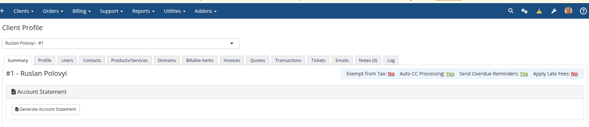

# Generate Statement

### Account Statement addon **[WHMCS](https://puqcloud.com/link.php?id=77)**
#####  [Order now](https://puqcloud.com/store/whmcs-addon-modules) | [Download](https://download.puqcloud.com/WHMCS/addons/PUQ_WHMCS-Account-Statement/) | [FAQ](https://community.puqcloud.com/)

The Generate page is available at: **Addons** > **PUQ Account Statement** > **Generate**

This is the main page for creating individual account statements for a specific client.

*03-generate.png*

---

## Generate from a Client's Profile

You can also start a statement directly from a client's profile. Open **Clients** > select a client, and on the **Summary** tab use the **Account Statement** panel and click **Generate Account Statement**. This opens the Generate page with the client pre-selected.

*21-admin-client-profile.png*

---

## Statement Parameters

### Client Selection

Use the search field to find a client by **first name, last name (or both together), company, email, or client ID**. The field uses Select2 with AJAX search — start typing to see results. Searching a full name such as "John Smith" matches first name + last name in any order.

> **Tip:** You can navigate here from the Dashboard's Quick Generate feature, which pre-selects the client.

### Date Range

Set the date range for the statement using:

- **Date From / Date To** — manual date inputs
- **Quick Period** buttons — one-click presets:
  - **This Month** — first to last day of current month
  - **Last Month** — first to last day of previous month
  - **This Year** — January 1 to December 31 of current year
  - **Last Year** — January 1 to December 31 of previous year

### Include Options

Select which financial data to include in the statement:

| Option | Description |
|--------|-------------|
| **Paid** | Include paid invoices |
| **Unpaid** | Include unpaid/outstanding invoices |
| **Refunded** | Include refunded invoices |
| **Transactions** | Include payment transactions |
| **Credits** | Include credit entries |

### Advanced Filters

| Filter | Description |
|--------|-------------|
| **Payment Methods** | Filter invoices by payment gateway (multi-select). Leave empty for all |
| **Product Groups** | Filter invoices by product group (multi-select). Leave empty for all |

---

## Actions

### View Statement

Click **View Statement** to generate and display the statement preview inline on the page. The preview shows the rendered HTML statement with all sections.

> **Reading the balance:** The summary shows two distinct figures — **Account Credit** (the credit available on the client's WHMCS account) and the **Closing Balance**, which is the outstanding amount. A negative Closing Balance means the client owes that amount, and it always ties out with the Debit and Credit columns. The **Open Balance** line carries forward any unpaid invoices from before the statement period and can be hidden via *Settings → Show Open Balance*.

> **Language & dates:** Statements (preview, PDF, and CSV) are generated in the **client's own language** when available — falling back to the system language, then English. Dates follow your **WHMCS Global Date Format**.

### Download PDF

Click **Download PDF** to generate and download the statement as a PDF file. The PDF uses the template configured in the Settings page.

### Download CSV

Click **Download CSV** to generate and download the statement data as a CSV file for import into spreadsheets or accounting software.

---

## Statement Preview Actions

After viewing a statement, additional action buttons appear in the preview header:

| Action | Description |
|--------|-------------|
| **Save to Archive** | Save the statement to the saved statements archive for future reference |
| **Send to Client** | Send the statement to the client via email with PDF attachment |
| **Generate Link** | Generate a public shareable link (copied to clipboard automatically) |

*04-generate-preview.png*
