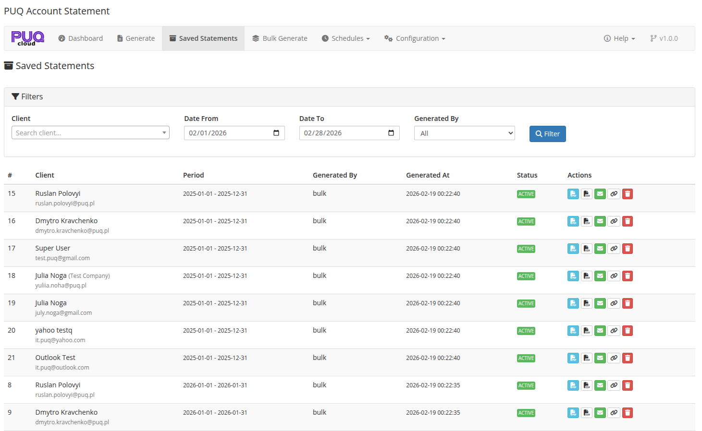

# Saved Statements

### Account Statement addon **[WHMCS](https://puqcloud.com/link.php?id=77)**
#####  [Order now](https://puqcloud.com/store/whmcs-addon-modules) | [Download](https://download.puqcloud.com/WHMCS/addons/PUQ_WHMCS-Account-Statement/) | [FAQ](https://community.puqcloud.com/)

The Saved Statements page is available at: **Addons** > **PUQ Account Statement** > **Saved Statements**

This page shows all previously saved account statements with filtering, pagination, and management tools.

*05-saved-statements.png*

---

## Filters

The top panel provides search and filter options:

| Filter | Description |
|--------|-------------|
| **Client** | Search for a specific client by name or email (Select2 AJAX search) |
| **Date From** | Filter statements created from this date |
| **Date To** | Filter statements created up to this date |
| **Generated By** | Filter by generation method: All, Manual, Schedule, or Bulk |

Click **Filter** to apply the filters and reload the results.

---

## Statements Table

The main table lists saved statements with the following columns:

| Column | Description |
|--------|-------------|
| **#** | Statement ID |
| **Client** | Client name, company name, and email |
| **Period** | Statement date range (from — to) |
| **Generated By** | How the statement was created: manual, schedule, or bulk |
| **Generated At** | Timestamp when the statement was generated |
| **Status** | Badge: **Active** (green) or expired status |
| **Actions** | Action buttons (see below) |

---

## Actions Per Statement

Each statement row has the following action buttons:

| Button | Icon | Description |
|--------|------|-------------|
| **PDF** | file-pdf | Download/view the statement as PDF (opens in new tab) |
| **CSV** | file-csv | Download the statement data as CSV |
| **Send** | envelope | Send the statement to the client via email with PDF attachment |
| **Copy Link** | link | Generate a public shareable link and copy it to clipboard |
| **Delete** | trash | Delete the saved statement (requires confirmation) |

---

## Pagination

When there are more statements than the configured per-page limit (default: 25), pagination controls appear at the bottom of the table with page numbers and previous/next navigation.

---

## Auto-Cleanup

Saved statements can be automatically deleted after a configurable number of days. This is set in **Settings** > **Auto Cleanup Days**. Set to 0 to disable auto-cleanup.
