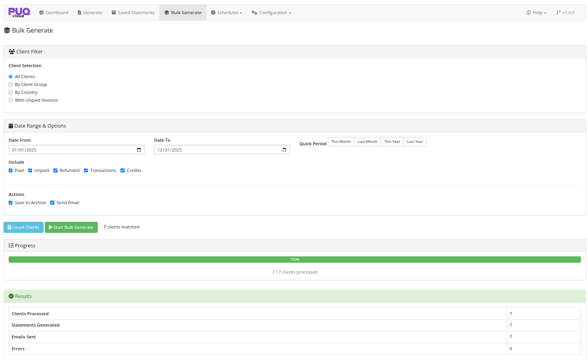

# Bulk Generate

### Account Statement addon **[WHMCS](https://puqcloud.com/link.php?id=77)**
#####  [Order now](https://puqcloud.com/store/whmcs-addon-modules) | [Download](https://download.puqcloud.com/WHMCS/addons/PUQ_WHMCS-Account-Statement/) | [FAQ](https://community.puqcloud.com/)

The Bulk Generate page is available at: **Addons** > **PUQ Account Statement** > **Bulk Generate**

This page allows you to generate statements for multiple clients at once with a single operation.

*06-bulk-generate.png*

---

## Client Filter

Choose which clients to generate statements for:

| Option | Description |
|--------|-------------|
| **All Clients** | Generate for every client in the system |
| **By Client Group** | Filter by WHMCS client group (dropdown appears for selection) |
| **By Country** | Filter by client country (dropdown appears for selection) |
| **With Unpaid Invoices** | Only clients that have outstanding unpaid invoices |

When selecting **By Client Group** or **By Country**, a dropdown field appears to select the specific group or country.

---

## Date Range & Options

### Date Range

Set the statement period using:

- **Date From / Date To** — manual date inputs
- **Quick Period** buttons — same presets as the Generate page (This Month, Last Month, This Year, Last Year)

The default period is set to **Last Month**.

### Include Options

Same checkboxes as the Generate page:
- Paid, Unpaid, Refunded, Transactions, Credits

### Actions

Choose what to do with each generated statement:

| Action | Description |
|--------|-------------|
| **Save to Archive** | Save each statement to the saved statements archive (checked by default) |
| **Send Email** | Send each statement to the respective client via email with PDF attachment |

---

## Workflow

### Step 1: Count Clients

Click **Count Clients** to see how many clients match your filter criteria. The result appears next to the button (e.g., "**42** clients matched").

### Step 2: Start Bulk Generate

After counting, the **Start Bulk Generate** button becomes enabled. Click it and confirm the operation.

### Step 3: Monitor Progress

A progress bar appears showing:
- Visual progress bar with percentage
- Text counter: "X / Y clients processed"

The bulk operation processes clients in batches of 10 for optimal performance and to avoid timeouts.

### Step 4: Review Results

After completion, a results panel shows:

| Metric | Description |
|--------|-------------|
| **Clients Processed** | Total number of clients processed |
| **Statements Generated** | Number of statements successfully created |
| **Emails Sent** | Number of emails sent (if email option was enabled) |
| **Errors** | Number of errors encountered during processing |
