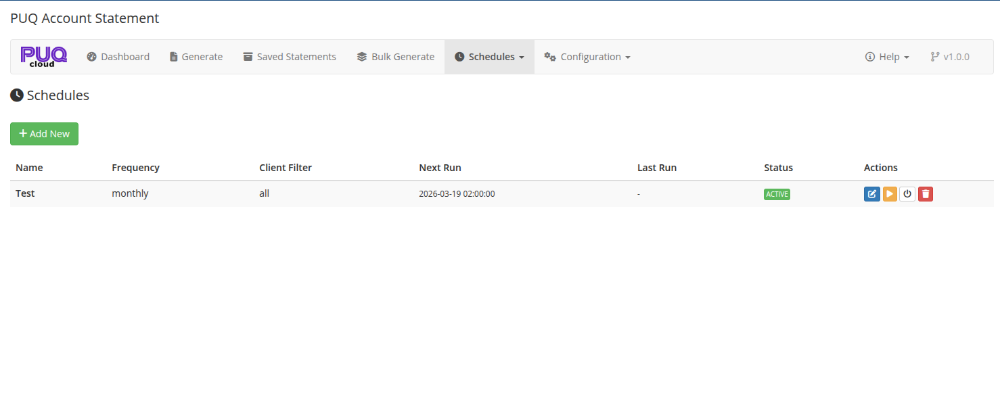

# Schedules

### Account Statement addon **[WHMCS](https://puqcloud.com/link.php?id=77)**
#####  [Order now](https://puqcloud.com/store/whmcs-addon-modules) | [Download](https://download.puqcloud.com/WHMCS/addons/PUQ_WHMCS-Account-Statement/) | [FAQ](https://community.puqcloud.com/)

The Schedules page is available at: **Addons** > **PUQ Account Statement** > **Schedules** > **All Schedules**

This page manages automated statement generation schedules. Schedules run automatically via WHMCS cron.

*07-schedules.png*

---

## Schedules Table

The table lists all configured schedules with the following columns:

| Column | Description |
|--------|-------------|
| **Name** | Schedule name for identification |
| **Frequency** | How often it runs: Daily, Weekly, Monthly, Quarterly, Yearly |
| **Client Filter** | Target clients: All, By Group, By Country, or With Unpaid Invoices |
| **Next Run** | Date and time of the next scheduled execution |
| **Last Run** | Date and time of the most recent execution |
| **Status** | Badge: **Active** (green) or **Inactive** (gray) |
| **Actions** | Action buttons (see below) |

---

## Actions Per Schedule

| Button | Icon | Description |
|--------|------|-------------|
| **Edit** | edit | Open the schedule editor to modify settings |
| **Run Now** | play | Execute the schedule immediately without waiting for the next scheduled time |
| **Toggle** | power-off | Enable or disable the schedule |
| **Delete** | trash | Delete the schedule (requires confirmation) |

---

## Creating a New Schedule

Click the **Add New** button at the top or go to **Schedules** > **Add Schedule** in the navigation menu.

See the [Schedule Editor](09-schedule-editor.md) page for details on configuring a schedule.

---

## How Schedules Work

Schedules are executed by the WHMCS cron job. When a schedule's next run time is reached:

1. The module identifies matching clients based on the schedule's client filter
2. For each client, a statement is generated for the configured period
3. Depending on the schedule's output settings, statements are saved to archive and/or emailed to clients
4. The schedule's next run time is updated based on its frequency
5. Execution details are logged for reference
