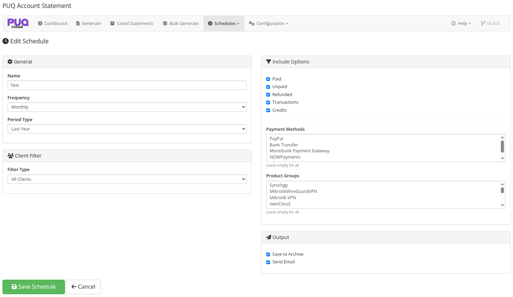

# Schedule Editor

### Account Statement addon **[WHMCS](https://puqcloud.com/link.php?id=77)**
#####  [Order now](https://puqcloud.com/store/whmcs-addon-modules) | [Download](https://download.puqcloud.com/WHMCS/addons/PUQ_WHMCS-Account-Statement/) | [FAQ](https://community.puqcloud.com/)

The Schedule Editor page is available at: **Addons** > **PUQ Account Statement** > **Schedules** > **Add Schedule** (or click **Edit** on an existing schedule)

This page allows you to create or edit an automated statement generation schedule.

*08-schedule-edit.png*

---

## General Settings

| Setting | Description |
|---------|-------------|
| **Name** | A descriptive name for the schedule (e.g., "Monthly Client Statements") |
| **Frequency** | How often the schedule runs: Daily, Weekly, Monthly, Quarterly, Yearly |
| **Period Type** | What period the statement covers: Last Month, Last Quarter, Last Year, or Custom |

---

## Client Filter

Choose which clients receive statements when the schedule runs:

| Filter | Description |
|--------|-------------|
| **All Clients** | Generate for every client |
| **By Client Group** | Only clients in a specific WHMCS client group |
| **By Country** | Only clients from a specific country |
| **With Unpaid Invoices** | Only clients with outstanding invoices |

When selecting **By Client Group** or **By Country**, a text field appears to enter the filter value.

---

## Include Options

Configure what financial data to include in the generated statements:

- **Paid** — include paid invoices
- **Unpaid** — include unpaid invoices
- **Refunded** — include refunded invoices
- **Transactions** — include payment transactions
- **Credits** — include credit entries

### Advanced Filters

| Filter | Description |
|--------|-------------|
| **Payment Methods** | Only include invoices paid via specific gateways (multi-select, leave empty for all) |
| **Product Groups** | Only include invoices for specific product groups (multi-select, leave empty for all) |

---

## Output

Configure what happens with each generated statement:

| Option | Description |
|--------|-------------|
| **Save to Archive** | Save the statement to the saved statements archive (checked by default) |
| **Send Email** | Send the statement to the client via email with PDF attachment |

---

## Saving

Click **Save Schedule** to create or update the schedule. After saving a new schedule, the page reloads with the schedule ID in the URL for future editing.

Click **Cancel** to return to the schedules list without saving.
