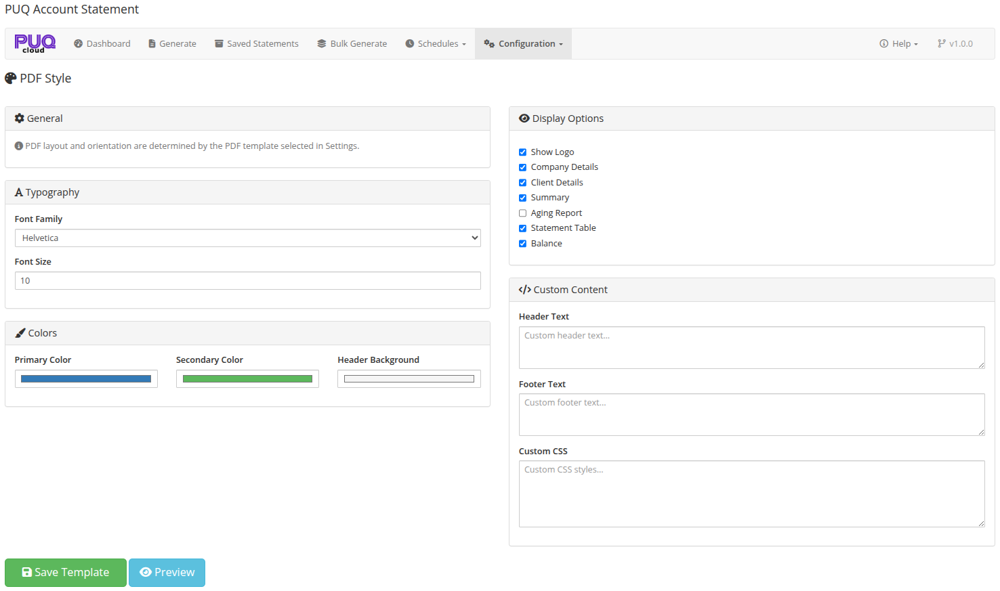
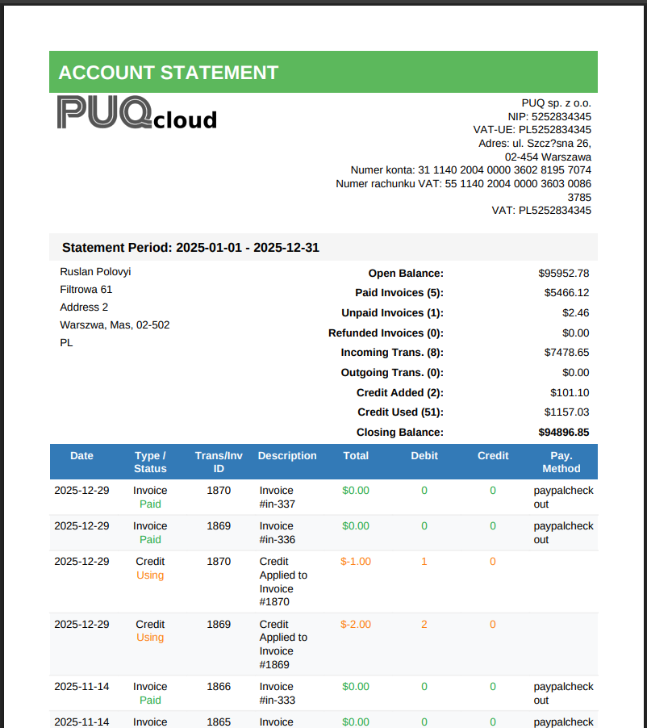
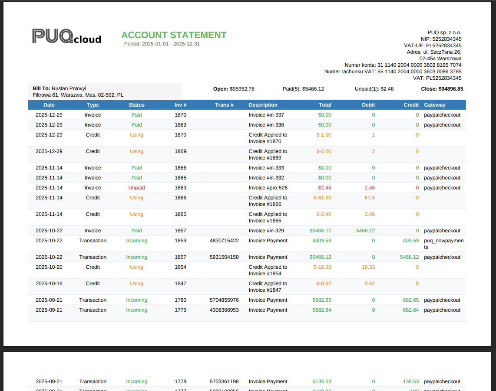
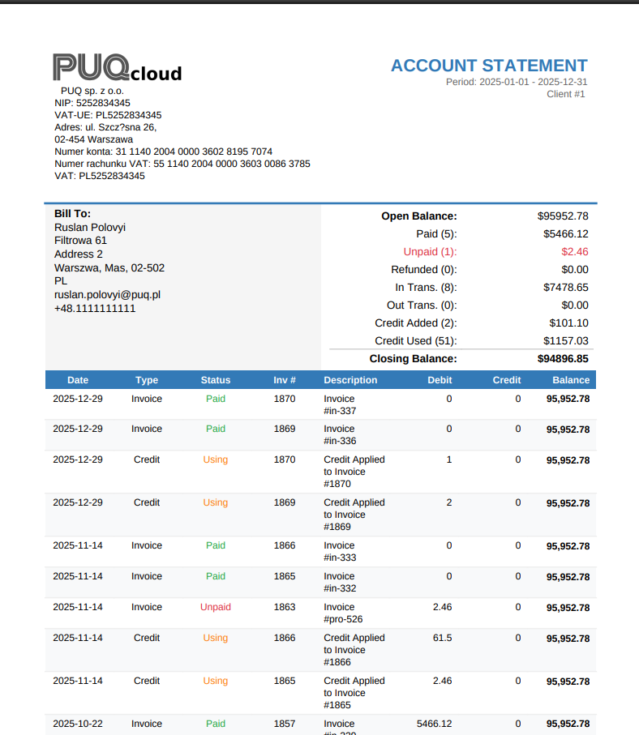
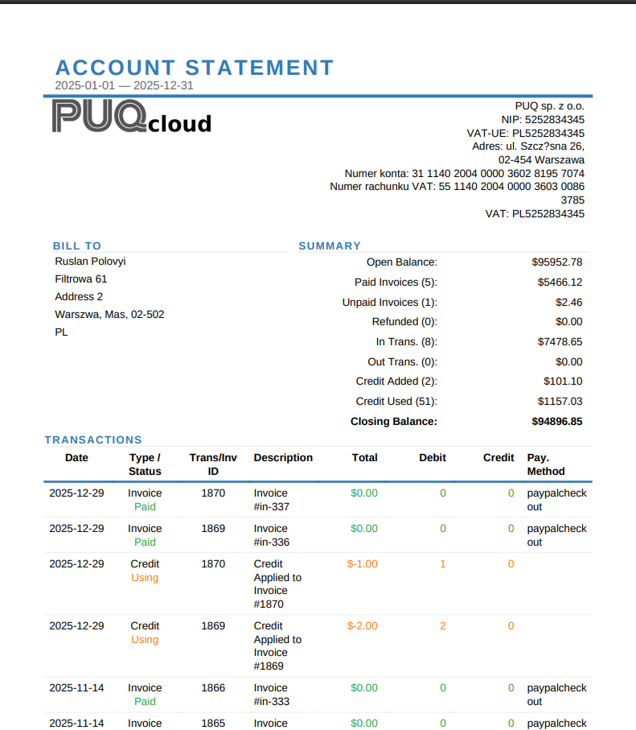
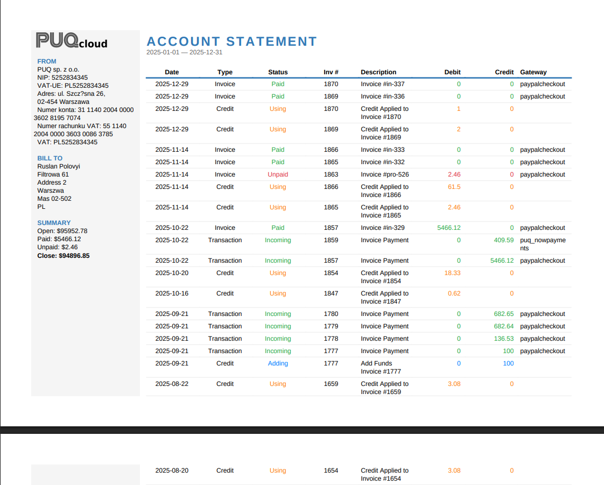
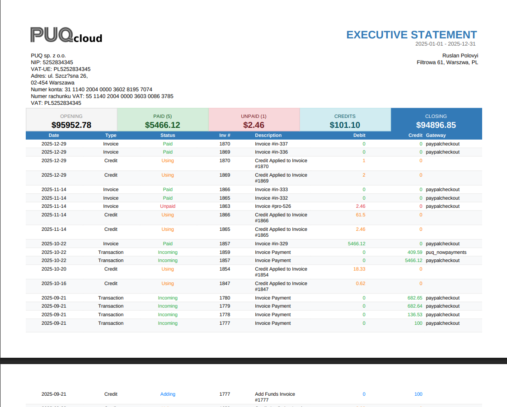
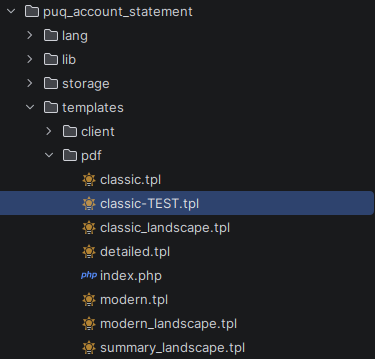
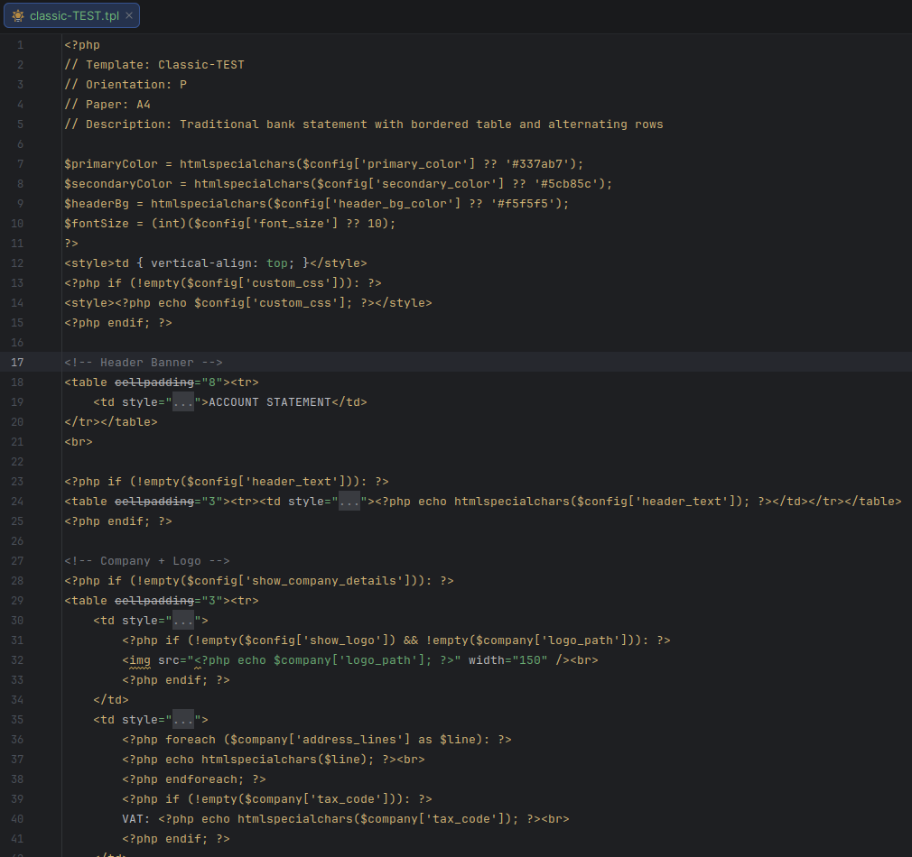

# PDF Style

### Account Statement addon **[WHMCS](https://puqcloud.com/link.php?id=77)**
#####  [Order now](https://puqcloud.com/store/whmcs-addon-modules) | [Download](https://download.puqcloud.com/WHMCS/addons/PUQ_WHMCS-Account-Statement/) | [FAQ](https://community.puqcloud.com/)

The PDF Style page is available at: **Addons** > **PUQ Account Statement** > **Configuration** > **PDF Style**

This page allows you to customize the appearance and content of generated PDF statements.


*09-pdf-style.png*

---

## General

An informational note that PDF layout and orientation are determined by the PDF template selected in the Settings page. The Style editor controls visual appearance within the selected template.

---

## Typography

| Setting | Description |
|---------|-------------|
| **Font Family** | Choose the PDF font: Helvetica, Times, Courier, DejaVu Sans, Free Serif |
| **Font Size** | Base font size in points (6–24, default: 10) |

> **Tip:** Use **DejaVu Sans** or **Free Serif** for full Unicode character support (Cyrillic, Asian characters, etc.).

---

## Colors

| Setting | Description |
|---------|-------------|
| **Primary Color** | Main color used for headings, table headers, and accents (default: #337ab7) |
| **Secondary Color** | Secondary color for subtitles and less prominent text (default: #555555) |
| **Header Background** | Background color for table header rows (default: #f5f5f5) |

---

## Display Options

Toggle which sections appear in the generated PDF:

| Option | Description |
|--------|-------------|
| **Show Logo** | Display the company logo at the top of the statement |
| **Company Details** | Show company name, address, and contact information |
| **Client Details** | Show client name, address, and contact information |
| **Summary** | Show the financial summary section (totals for invoices, transactions, credits) |
| **Aging Report** | Show the aging report section for overdue invoice analysis |
| **Statement Table** | Show the detailed statement table with individual line items |
| **Balance** | Show the running balance and final balance totals |

---

## Custom Content

| Setting | Description |
|---------|-------------|
| **Header Text** | Custom text displayed at the top of the statement (below the logo/company info) |
| **Footer Text** | Custom text displayed at the bottom of the statement |
| **Custom CSS** | Additional CSS styles applied to the PDF. Use for fine-tuning fonts, spacing, borders, etc. |

---

## Preview

Click the **Preview** button to generate a sample PDF with the current (unsaved) settings. This opens the PDF in a new browser tab so you can review changes before saving.

> **Note:** The preview uses current unsaved settings, allowing you to experiment without affecting live statements.

---

## Saving

Click **Save Template** to save all style settings. These settings apply globally to all PDF statements generated by the module.

---

## PDF Template Examples

The module includes several built-in PDF templates. The template is selected in **Settings** > **PDF Template**.

### Classic (Portrait)

Traditional bank statement layout with bordered table and alternating rows.


*12-pdf-classic.png*

### Classic (Landscape)

Same classic layout in landscape orientation, showing more columns.


*13-pdf-classic-landscape.png*

### Modern (Portrait)

Clean modern design with color-coded summary cards and running balance column.


*14-pdf-modern.png*

### Detailed (Portrait)

Comprehensive layout with full company details, client information, and detailed transaction table.


*15-pdf-detailed.png*

### Modern (Landscape)

Modern layout in landscape orientation with expanded column space.


*16-pdf-modern-landscape.png*

### Summary (Landscape)

Executive summary format with color-coded totals and compact transaction table.


*17-pdf-summary-landscape.png*

---

## Custom PDF Templates

You can create custom PDF templates by adding `.tpl` files to the `templates/pdf/` directory.


*18-pdf-templates-tree.png*

Each template file must start with a PHP comment header that defines its metadata:

```php
<?php
// Template: My Custom Template
// Orientation: P
// Paper: A4
// Description: My custom statement layout
```


*19-pdf-template-code.png*

### Template Header Fields

| Field | Description |
|-------|-------------|
| **Template** | Display name shown in the Settings dropdown |
| **Orientation** | `P` for Portrait, `L` for Landscape |
| **Paper** | Paper size: `A4`, `Letter`, etc. |
| **Description** | Optional description shown as tooltip |

### Available Template Variables

Templates receive the following variables:

| Variable | Description |
|----------|-------------|
| `$config` | Style settings (colors, fonts, display options) from the PDF Style page |
| `$company` | Company details (name, address, logo, tax info) |
| `$statement` | Statement data (client info, period, invoices, transactions, credits, summary) |

After adding a new template file, it automatically appears in the **Settings** > **PDF Template** dropdown.
