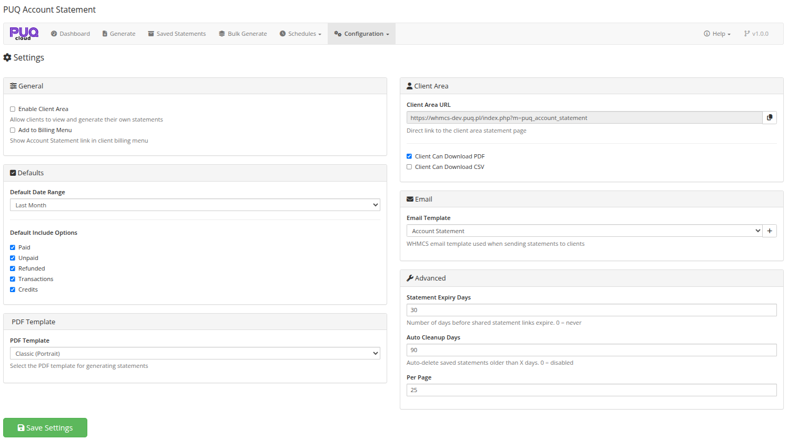
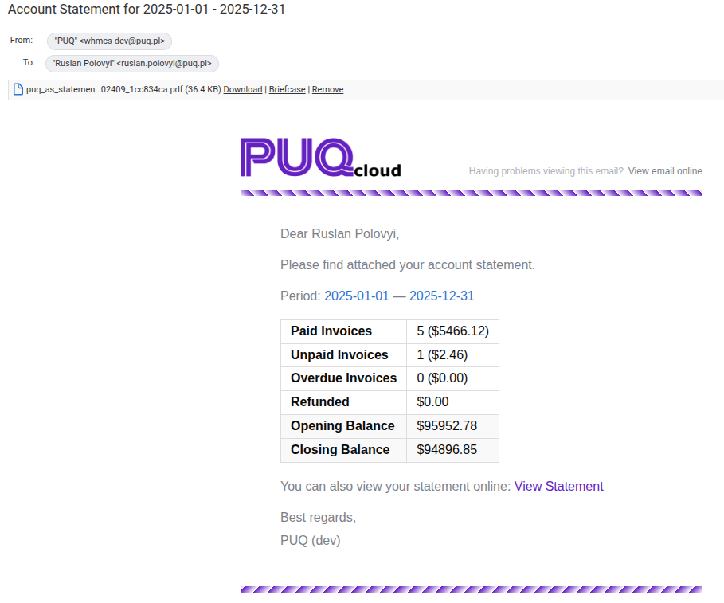

# Settings

### Account Statement addon **[WHMCS](https://puqcloud.com/link.php?id=77)**
#####  [Order now](https://puqcloud.com/store/whmcs-addon-modules) | [Download](https://download.puqcloud.com/WHMCS/addons/PUQ_WHMCS-Account-Statement/) | [FAQ](https://community.puqcloud.com/)

The Settings page is available at: **Addons** > **PUQ Account Statement** > **Configuration** > **Settings**

This page controls the module's global settings including client area access, defaults, PDF template selection, email configuration, and advanced options.

*10-settings.png*

---

## General

| Setting | Description |
|---------|-------------|
| **Enable Client Area** | Allow clients to access the Account Statement page in the client area |
| **Add to Billing Menu** | Show an "Account Statement" link in the client area billing navigation menu |

---

## Defaults

### Default Date Range

Set the default date range preset that is used when a client opens the statement page:

| Option | Period |
|--------|--------|
| **This Month** | First to last day of the current month |
| **Last Month** | First to last day of the previous month |
| **This Quarter** | First day of current quarter to today |
| **Last Quarter** | First to last day of the previous quarter |
| **This Year** | January 1 to December 31 of current year |
| **Last Year** | January 1 to December 31 of previous year |

### Default Include Options

Set which financial data types are included by default when generating statements:

- Paid
- Unpaid
- Refunded
- Transactions
- Credits

---

## PDF Template

| Setting | Description |
|---------|-------------|
| **PDF Template** | Select the PDF layout template for generating statements. Available templates include Classic, Modern, Detailed — in Portrait or Landscape orientation |

The dropdown is dynamically populated from template files in the `templates/pdf/` directory. Each option shows the template name and orientation.

---

## Client Area

| Setting | Description |
|---------|-------------|
| **Client Area URL** | The direct link to the client area statement page (read-only, with copy button) |
| **Client Can Download PDF** | Allow clients to download PDF versions of their statements |
| **Client Can Download CSV** | Allow clients to download CSV versions of their statements |

---

## Email

| Setting | Description |
|---------|-------------|
| **Email Template** | Select which WHMCS email template to use when sending statements to clients |
| **Create (+)** | Click the + button to create the default "Account Statement" email template in WHMCS if it doesn't exist yet |

The dropdown is populated with all available WHMCS General email templates.

### Email Example

When a statement is sent to a client (manually, via bulk, or via schedule), they receive an email with a PDF attachment and a summary of the statement:

*20-email-statement.png*

The email includes:
- PDF statement as attachment
- Statement period
- Summary table with paid/unpaid invoices, credits, opening and closing balance
- Link to view the statement online

---

## Advanced

| Setting | Description |
|---------|-------------|
| **Statement Expiry Days** | Number of days before shared statement links expire. Set to 0 for links that never expire (default: 30) |
| **Auto Cleanup Days** | Automatically delete saved statements older than this many days. Set to 0 to disable auto-cleanup (default: 90) |
| **Per Page** | Number of records per page in statement lists (5–100, default: 25) |

---

## Saving

Click **Save Settings** to save all configuration changes.
