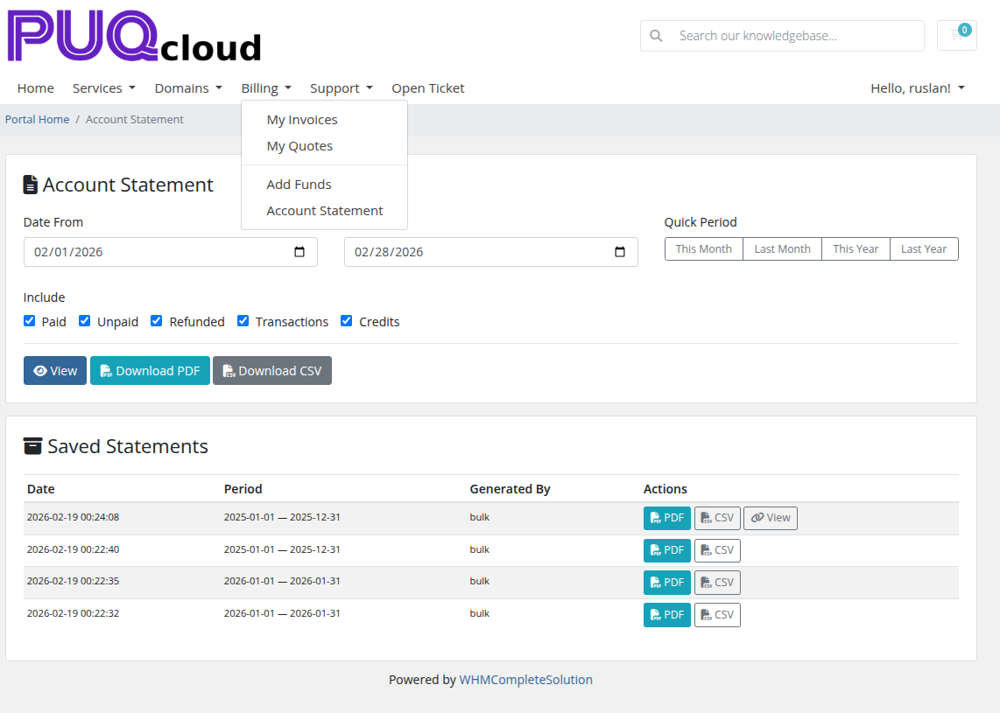

# Client Area

### Account Statement addon **[WHMCS](https://puqcloud.com/link.php?id=77)**
#####  [Order now](https://puqcloud.com/store/whmcs-addon-modules) | [Download](https://download.puqcloud.com/WHMCS/addons/PUQ_WHMCS-Account-Statement/) | [FAQ](https://community.puqcloud.com/)

This page describes the client-facing Account Statement functionality available in the WHMCS client area.

---

## Accessing the Client Area Page

Clients can access their Account Statement page in two ways:

1. **Direct URL** — navigate to `https://your-whmcs.com/index.php?m=puq_account_statement`
2. **Billing Menu** — if "Add to Billing Menu" is enabled in Settings, a link appears in the client area billing navigation

> **Note:** The client area page is only available when "Enable Client Area" is checked in the module Settings.

*11-client-area.png*

---

## Generate Statement

The top section allows clients to generate their own account statements:

### Date Range

- **Date From / Date To** — manual date pickers
- **Quick Period** buttons — one-click presets: This Month, Last Month, This Year, Last Year

### Include Options

Checkboxes to select what financial data to include:
- Paid, Unpaid, Refunded, Transactions, Credits

### Action Buttons

| Button | Description | Visibility |
|--------|-------------|------------|
| **View** | Generate and display the statement preview inline | Always visible |
| **Download PDF** | Download the statement as a PDF file | Only if "Client Can Download PDF" is enabled in Settings |
| **Download CSV** | Download the statement data as a CSV file | Only if "Client Can Download CSV" is enabled in Settings |

---

## Statement Preview

After clicking **View**, the generated statement is displayed inline below the form. The preview shows the same rendered HTML statement that administrators see.

---

## Saved Statements

The bottom section shows the client's previously saved statements (generated by admin, schedule, or bulk operations):

| Column | Description |
|--------|-------------|
| **Date** | When the statement was generated |
| **Period** | Statement date range (from — to) |
| **Generated By** | How the statement was created: manual, schedule, or bulk |
| **Actions** | Download buttons and view link |

### Actions Per Saved Statement

| Button | Description | Visibility |
|--------|-------------|------------|
| **PDF** | Download the statement as PDF | Always visible |
| **CSV** | Download the statement as CSV | Only if "Client Can Download CSV" is enabled |
| **View** | Open the statement via public link (if available) | Only if statement has an access hash |

### Pagination

When there are multiple pages of saved statements, pagination controls appear below the table with page numbers and previous/next navigation.

---

## Important Notes

- Clients can only see their own statements — all requests are filtered by the logged-in client's ID
- The client area uses Bootstrap 4 styling (WHMCS client area) rather than Bootstrap 3 (admin area)
- Download buttons (PDF/CSV) respect the permission settings configured in the admin Settings page
- The statement is generated with the client's configured currency
