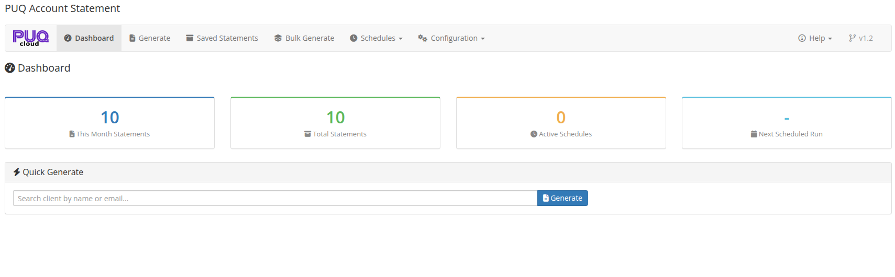
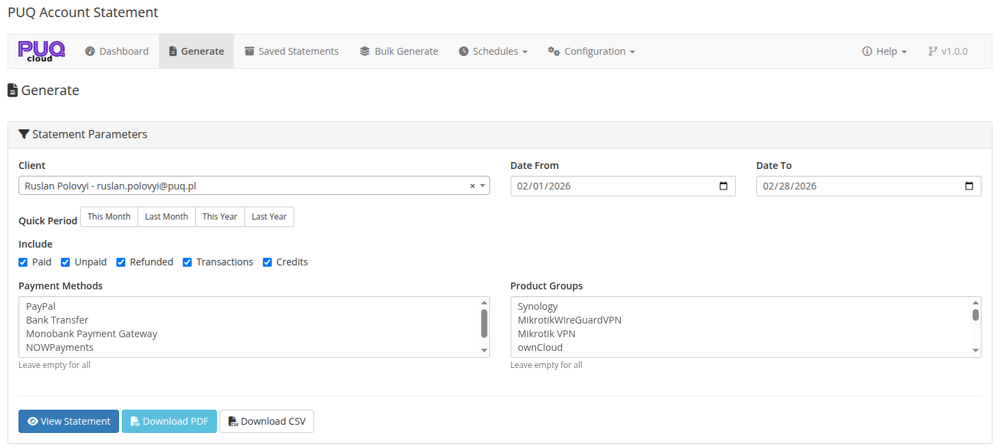
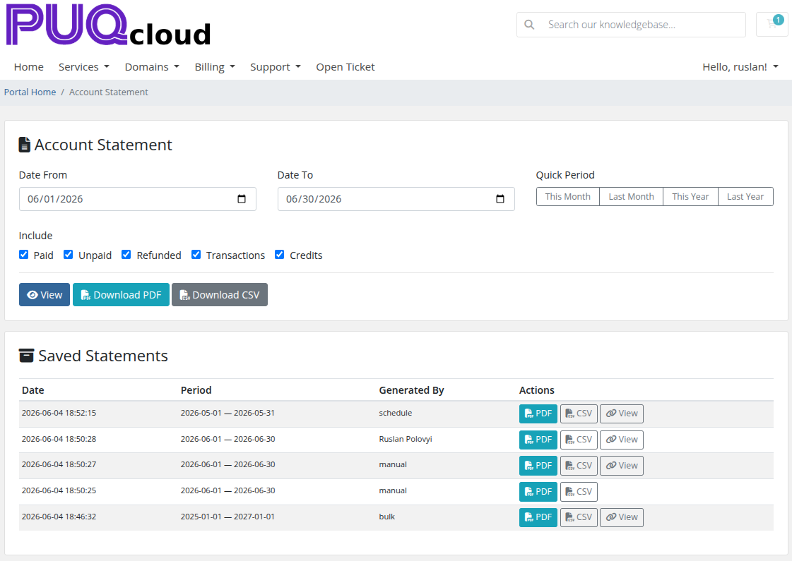

# Description

### PUQ Account Statement module **[WHMCS](https://puqcloud.com/link.php?id=77)**
##### [Order now](https://puqcloud.com/whmcs-addon-puq-account-statement.php) | [Download](https://download.puqcloud.com/WHMCS/addons/PUQ_WHMCS-Account-Statement/) | [Community](https://community.puqcloud.com/)

## PUQ Account Statement — WHMCS Addon

**PUQ Account Statement** is an addon module for WHMCS that generates comprehensive financial statements for clients. It consolidates invoices, transactions, and credits into detailed account statements with PDF and CSV export, scheduled automatic generation, bulk processing, and client area self-service access.

---

## Key Features

- **Statement Generation** — generate detailed financial statements for any client with customizable date ranges and filters
- **Clear Outstanding Balance** — the closing balance shows exactly how much the client owes (negative = owed) and ties out with the Debit/Credit columns; Account Credit is shown as a separate figure
- **Multilingual Statements** — PDF, preview, and CSV are generated in the client's own language (falling back to system language, then English), translated across 26 languages
- **WHMCS Date Format** — statement dates follow your WHMCS Global Date Format
- **Multiple Export Formats** — export statements as PDF or CSV files
- **Customizable PDF Templates** — choose from multiple PDF layouts (Classic, Modern, Detailed) in Portrait or Landscape orientation
- **PDF Style Editor** — customize typography, colors, display options, header/footer text, and custom CSS
- **Saved Statements Archive** — save generated statements for future reference with search and filter capabilities
- **Bulk Generation** — generate statements for multiple clients at once, filtered by client group, country, or unpaid invoices
- **Scheduled Generation** — automate statement generation with configurable schedules (daily, weekly, monthly, quarterly, yearly), including automated "All Unpaid Invoices" recurring reminders across all years
- **Client Area Access** — allow clients to view, generate, and download their own statements
- **Email Delivery** — send statements to clients via email with PDF attachment using customizable WHMCS email templates
- **Public Shareable Links** — generate expiring public links to share statements externally
- **Aging Report** — include overdue invoice aging analysis in statements
- **Invoice Filtering** — filter by payment status (paid, unpaid, refunded), payment methods, and product groups
- **Transaction & Credit Tracking** — include transactions and credit entries in statements
- **Quick Period Selection** — one-click date range presets (This Month, Last Month, This Year, Last Year, All Time)
- **Database Schema Verification** — built-in maintenance tool to inspect and non-destructively upgrade module tables and columns
- **Dashboard** — overview with key metrics, quick generate, recent statements, and upcoming schedules
- **License system** — online/offline license verification with graceful degradation (dashboard remains accessible without a license)
- **Multilingual interface** — admin and client area available in 26 languages

---

## System Requirements

| Requirement | Minimum |
|-------------|---------|
| **WHMCS** | 8.x+, 9.x+ |
| **PHP** | 7.4, 8.1, 8.2, 8.3, 8.4 |
| **ionCube Loader** | v15+ |

---

## Module Components

| Component | Type | Directory |
|-----------|------|-----------|
| Addon Module | `puq_account_statement` | `modules/addons/puq_account_statement/` |

---

## Links

- **Product page:** [https://puqcloud.com/whmcs-addon-puq-account-statement.php](https://puqcloud.com/whmcs-addon-puq-account-statement.php)
- **Documentation:** [https://doc.puq.info/books/account-statement-whmcs-addon](https://doc.puq.info/books/account-statement-whmcs-addon)
- **Support:** [https://puqcloud.com/submitticket.php](https://puqcloud.com/submitticket.php?step=2&deptid=1)
- **Community:** [https://community.puqcloud.com/](https://community.puqcloud.com/)

---

## Screenshots

### Admin Area — Dashboard

*02-dashboard.png*

### Admin Area — Generate Statement

*03-generate.png*

### Client Area — Statement Overview

*11-client-area.png*
